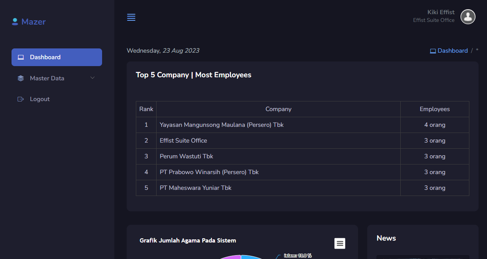
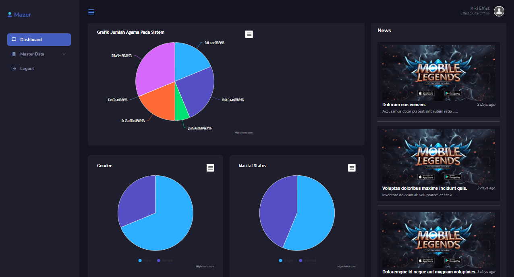

## Information

- Laravel v8.83.27
- PHP 7.4
- Mysql 8.0.31
- Using YajraBox DataTable
- Using Mazer Template (Near Pro)
- Using Highchart JS

## Installation

1. Clone this project

```
git clone https://github.com/MuhammadRejeki/effist-magang.git
cd effist-magang/laravel
```

2. Download vendor library (make sure you already in "(your repository)/laravel")

```
composer install
php artisan vendor:publish --tag=datatables
php -r "copy('.env.example', '.env');"
php artisan key:generate
```

3. Configure and migrate the database

```
- Configure your database on .env
- use command "php artisan migrate:fresh --seed"
```

4. ENJOY





<b> DEVELOPER MAGANG TEST | KIKI</b>
